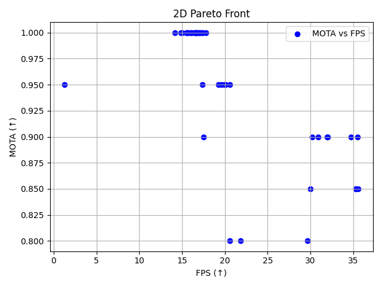

# Particle-Filter-People_Tracking



A modular, real-time people-tracking framework combining YOLOv8 detection, Deep SORT association, and a QPSO-based multi-objective optimizer for safety-critical surveillance applications (e.g. nuclear power plant control rooms). Automatically discovers Pareto-optimal trade-offs between accuracy (MOTA, IDF1) and latency (FPS).

## 🚀 Features

- **High-Speed Detection**: Ultralytics YOLOv8 detector (≈120 FPS on RTX 2050).
- **Robust Association**: Deep SORT with MobileNetV2 embeddings.
- **Automated Tuning**: Quantum-behaved PSO (QPSO) over mixed discrete–continuous hyperparameters.
- **Multi-Objective**: Optimizes for MOTA & IDF1 (↑) vs. FPS (↓ 1/FPS), yields Pareto front.
- **Reproducible**: YAML-driven configs + fixed random seeds.
- **Results & Analysis**: Pareto plots, ablations, failure-mode diagnostics.

## 📁 Repository Structure

```

.
├── main.py                  # Entry-point: runs end-to-end pipeline
├── run\_plot\_pareto.py       # Standalone Pareto-curve plotting
├── requirements.txt         # Python dependencies
├── yolov8n.pt               # Pretrained YOLOv8-n weights
│
├── detectors/
│   └── yolo\_detector.py     # Wrapper for YOLOv8 inference
│
├── trackers/
│   ├── deepsort\_wrapper.py  # Deep SORT interface
│   └── bytetrack\_wrapper.py # (Optional) ByteTrack interface
│
├── optimization/
│   ├── config.py            # QPSO parameter bounds
│   ├── config.yaml          # Hyperparameter search space
│   ├── qpso\_optimizer.py    # QPSO implementation
│   ├── nsga\_optimizer.py    # (Optional) NSGA-II implementation
│   └── plot\_pareto.py       # Visualization utilities
│
├── evaluation/
│   └── evaluation.py        # MOTA/IDF1 & FPS computation (py-motmetrics)
│
├── utils/
│   ├── video\_io.py          # Video read/write helpers
│   └── draw\_utils.py        # Bounding-box & track visualization
│
├── sample\_videos/
│   └── test\_video.mp4       # Example input for quick demo
│
├── results/
│   ├── optimization\_log.csv # Raw QPSO fitness logs
│   ├── pareto\_2d.png        # 2D Pareto frontier
│   ├── pareto\_3d.png        # 3D Pareto frontier
│   ├── output\_tracking.avi  # Sample tracking output
│   └── output\_tracking.mp4  # Sample tracking output
└── README.md                # (this file)

```

## ⚙️ Installation

1. **Clone this repo**  
   ```bash
   git clone https://github.com/maxprogrammer007/Particle-Filter-People_tracking.git
   cd Particle-Filter-People_tracking/people_tracking_project


2. **Create a virtual environment** (recommended)

   ```bash
   python3 -m venv venv
   source venv/bin/activate   # Linux/Mac
   venv\Scripts\activate      # Windows
   ```

3. **Install dependencies**

   ```bash
   pip install -r requirements.txt
   ```

4. **Download YOLOv8 weights** (if not included)

   ```bash
   # Already provided as yolov8n.pt, or:
   wget https://github.com/ultralytics/ultralytics/releases/download/v8.0.0/yolov8n.pt
   ```

## 🎬 Quick Start

Run the full QPSO-tuned pipeline on sample videos:

```bash
python main.py \
  --videos sample_videos/test_video.mp4 \
  --config optimization/config.yaml \
  --out_dir results
```

Plot the Pareto frontier from a saved log:

```bash
python run_plot_pareto.py \
  --log_file results/optimization_log.csv \
  --save_path results/pareto_2d_updated.png
```

## 🔧 Configuration

All hyperparameters live in `optimization/config.yaml`.
Key entries include:

```yaml
img_size: [320, 480, 640]
tau_conf: [0.2, 0.8]
tau_nms:  [0.3, 0.7]
alpha:    [0.0, 1.0]
frame_skip: [1, 5]
```

Modify these to explore different ranges.

## 📈 Results

* **Best accuracy**: 98.5 % MOTA, 95.4 % IDF1 @ 12.3 FPS
* **Best speed**: 97.2 % MOTA, 94.1 % IDF1 @ 35.1 FPS
* **Pareto knee**: 97.8 % MOTA, 94.7 % IDF1 @ 23.4 FPS

See [Table I](#) and [pareto\_2d.png](results/pareto_2d.png) for full details.

## 🛠️ Customization

* Swap in another detector: place custom code under `detectors/` and update `main.py`.
* Use a different tracker: implement wrapper in `trackers/`.
* Try NSGA-II: call `optimization/nsga_optimizer.py` instead of QPSO.


